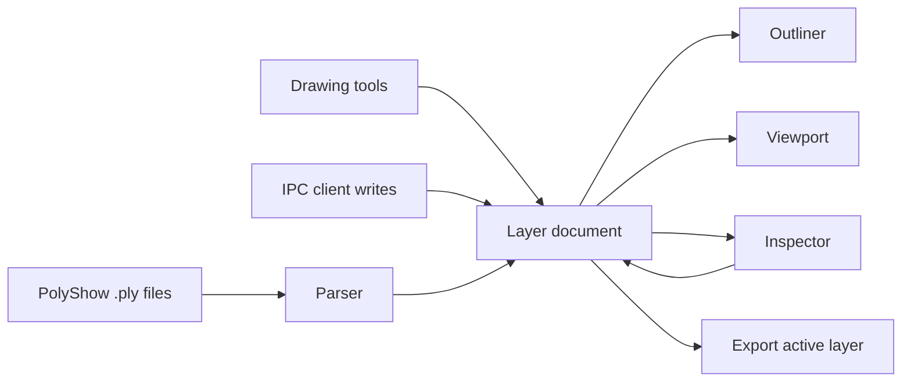

<p align="center">
  
</p>

# PolyShow

<p align="center">
  <strong>面向 2D 几何调试、检查与轻量编辑的 PolyShow 自定义 `.ply` 桌面工作台。</strong><br>
  <em>A Qt 6 desktop workbench for inspecting, editing, rendering, and streaming PolyShow custom 2D `.ply` geometry.</em>
</p>

<p align="center">
  <a href="https://www.qt.io"></a>
  <a href="https://en.cppreference.com/w/cpp/17"></a>
  
  
  
</p>

> [!IMPORTANT]
> PolyShow 的 `.ply` 是项目自定义的二维文本格式，不是 Polygon File Format / Stanford PLY。旧式 `ply / format ascii / element vertex / element face` 头部不会被当前解析器读取。
>
> PolyShow `.ply` is a project-specific 2D text format, not Stanford PLY.

## Contents / 目录

- [What is PolyShow? / PolyShow 是什么](#what-is-polyshow--polyshow-是什么)
- [Feature Tour / 功能导览](#feature-tour--功能导览)
- [User Guide / 使用指南](#user-guide--使用指南)
- [PolyShow `.ply` Format / 文件格式](#polyshow-ply-format--文件格式)
- [Rendering and Editing / 渲染与编辑](#rendering-and-editing--渲染与编辑)
- [IPC Workflow / IPC 工作流](#ipc-workflow--ipc-工作流)
- [Build from Source / 从源码构建](#build-from-source--从源码构建)
- [Project Layout / 项目结构](#project-layout--项目结构)
- [Verification / 验证方式](#verification--验证方式)
- [Design and Contribution Notes / 设计与协作约定](#design-and-contribution-notes--设计与协作约定)
- [Roadmap-style Notes / 后续方向](#roadmap-style-notes--后续方向)
- [License / 许可证](#license--许可证)

## What is PolyShow? / PolyShow 是什么

PolyShow 是一个深色空间编辑器风格的 Qt Widgets 桌面应用，用来把算法、仿真、调试脚本或外部进程产生的 2D 几何快速变成可查看、可选择、可编辑、可导出的图层化画布。

PolyShow is a dark, spatial-editor-style Qt Widgets application that turns custom 2D geometry text files and IPC writes into an inspectable layered viewport.



PolyShow 的核心思想很直接：把几何数据放在中心，把结构、属性和历史操作贴在周围，让用户能边看边定位问题。

The product model is intentionally simple: geometry stays in the center, structure and properties stay nearby, and operation feedback remains visible.

## Feature Tour / 功能导览

| 用户能力 | User capability | 当前行为 |
|---|---|---|
| 打开 `.ply` | Open `.ply` | 一次选择一个或多个 PolyShow `.ply` 文件，每个文件导入为独立图层。 |
| 图层管理 | Layer workflow | 新建普通内部图层或 IPC 图层；图层名在当前文档中必须唯一。 |
| 结构树 | Outliner | 左侧边栏显示图层和图元层级，可搜索，可展开折叠。 |
| 可见性控制 | Visibility | 图层和单个图元都有独立可见性复选框。 |
| 画布查看 | Viewport navigation | 鼠标滚轮缩放，中键拖拽平移，提供 Fit、Zoom、Reset 和网格开关。 |
| 直接绘制 | Direct drawing | 支持 Point、Line/Polyline、Polygon 绘制；折线和多边形可点击 Done 或右键提交。 |
| 选择检查 | Selection and inspection | 点击图元或结构树选择对象；右侧 Inspector 显示图层或图元细节。 |
| 样式编辑 | Style editing | 可编辑颜色、填充、线宽、点大小；错误会在 Inspector、日志和状态栏反馈。 |
| 坐标编辑 | Coordinate editing | 图元坐标可直接修改；非法草稿会隐藏误导性预览并显示错误。 |
| 渲染模式 | Render modes | `Solid`、`Wireframe`、`Points` 三种模式可从菜单或视口控件切换。 |
| 导出 | Export | 导出当前活动图层为 PolyShow `.ply` 文本文件。 |
| IPC 写入 | IPC streaming | 外部客户端可向已存在的 IPC layer 写入点、折线和多边形。 |

<details>
<summary>English feature summary</summary>

PolyShow can import multiple custom `.ply` files, organize them as layers, inspect and edit primitives, draw new geometry, toggle visibility, switch render modes, export the active layer, and receive geometry from an external IPC client.

</details>

## User Guide / 使用指南

### 1. 打开几何文件 / Open geometry

1. 启动 `polyshow`。
2. 使用 `File -> Open .ply...`，或快捷键 `Ctrl+O`。
3. 选择一个或多个 `test_data/ply` 或你自己的 PolyShow `.ply` 文件。
4. 导入成功后，每个文件会出现在左侧结构树中，并显示在中心视口。

If several files are selected, PolyShow imports every successfully parsed file and reports failed files with line-level parser messages.

### 2. 浏览视口 / Navigate the viewport

| 操作 | Action | 输入 |
|---|---|---|
| 缩放 | Zoom | 鼠标滚轮，或 `View -> Zoom In / Zoom Out` |
| 平移 | Pan | 鼠标中键拖拽 |
| 适配画面 | Fit | `View -> Fit to View` 或视口工具栏 Fit 按钮 |
| 重置视图 | Reset | `View -> Reset View` |
| 坐标读取 | Cursor coordinate | 鼠标移动时查看底部状态栏 `X / Y` |
| 网格显示 | Grid | 视口工具栏网格按钮 |

### 3. 管理图层和图元 / Manage layers and primitives

- `File -> New Layer` 创建新图层，快捷键 `Ctrl+Shift+N`。
- 新建图层可选择 `Internal Normal` 或 `IPC Layer`。
- 左侧结构树中，图层行代表一个导入文件或内部图层，子行代表图元。
- 复选框用于显示或隐藏图层、图元。
- 搜索按钮会展开搜索框，用于筛选图层和图元名称。
- 点击图层或图元会同步视口选区与右侧 Inspector。
- 按住 `Ctrl` 点击图元可进行图元级多选。

Layer rows and primitive rows remain synchronized with the viewport and inspector. Hidden primitives can still be selected from the outliner for inspection.

### 4. 绘制新图元 / Draw new primitives

视口顶部工具栏提供 `Browse`、`Point`、`Line`、`Poly` 四种工作模式。

| 模式 | Mode | 使用方式 |
|---|---|---|
| `Browse` | Browse | 点击选择图元，空白处点击清除选择。 |
| `Point` | Draw point | 左键点击一次，立即向活动图层添加点。 |
| `Line` | Draw polyline | 左键连续添加顶点，点击 `Done` 或右键提交。 |
| `Poly` | Draw polygon | 左键连续添加顶点，点击 `Done` 或右键提交；提交时会闭合为 polygon。 |

如果当前没有可用图层，开始绘制时会先创建图层。新图元会继承同类型最近图元的样式；没有同类型图元时使用默认样式。

If no active layer is available, PolyShow prompts for a layer before committing drawn geometry.

### 5. 编辑属性 / Edit properties

选择一个图元后，右侧 Inspector 会显示：

- 图元身份和几何摘要。
- `Stroke Color`、`Fill Color`、`Fill Enabled`、`Width`、`Point Size` 等样式字段。
- 可编辑坐标文本。

无效颜色、非正数线宽/点大小、非法坐标数量等会阻止写入，并在 Inspector、底部日志和状态栏中反馈。

When coordinate text becomes invalid, PolyShow suppresses misleading geometry preview until the draft becomes valid again.

### 6. 导出活动图层 / Export active layer

1. 在结构树或视口中选择一个图层或图层内图元，使该图层成为活动图层。
2. 使用 `File -> Export Active Layer...`，快捷键 `Ctrl+Shift+S`。
3. 保存为 PolyShow `.ply`。

Export serializes the active runtime layer back to the custom PolyShow `.ply` text format.

### Menu and Shortcuts / 菜单与快捷键

| 菜单 | Command | Shortcut | 说明 |
|---|---|---|---|
| `File` | `New Layer` | `Ctrl+Shift+N` | 创建普通内部图层或 IPC 图层。 |
| `File` | `Open .ply...` | `Ctrl+O` | 打开一个或多个 PolyShow `.ply` 文件。 |
| `File` | `Export Active Layer...` | `Ctrl+Shift+S` | 导出当前活动图层。 |
| `File` | `Exit` | 系统退出快捷键 | 关闭应用。 |
| `View` | `Fit to View` | - | 将当前几何适配到视口。 |
| `View` | `Zoom In` | `Ctrl++` | 放大。 |
| `View` | `Zoom Out` | `Ctrl+-` | 缩小。 |
| `View` | `Reset View` | - | 重置缩放并回到原点附近。 |
| `Render` | `Solid` | - | 点、线和带填充多边形。 |
| `Render` | `Wireframe` | - | 多边形只显示描边。 |
| `Render` | `Points` | - | 所有图元以顶点点位显示。 |
| `IPC` | `Start IPC Listener` | - | 启动 IPC 接收端。 |
| `IPC` | `Stop IPC Listener` | - | 停止 IPC 接收端。 |
| `Help` | `About` | - | 查看功能摘要。 |

## PolyShow `.ply` Format / 文件格式

PolyShow `.ply` 是 UTF-8 文本格式。它由一组坐标块组成，坐标块之间用 `NEXT` 分隔。

PolyShow `.ply` is a UTF-8 text format made of coordinate blocks separated by `NEXT`.

### Basic rules / 基本规则

| 规则 | Rule | 说明 |
|---|---|---|
| 坐标行 | Coordinate line | 每行两个数字：`x y` |
| 图形分隔 | Shape separator | 单独一行 `NEXT` |
| 空行 | Blank lines | 忽略 |
| 注释 | Comments | `#` 开头的整行注释会被忽略 |
| 文件结尾 | EOF | 最后一个图形后可以不写 `NEXT` |

### Primitive detection / 图元判定

| 点数和首尾关系 | Result |
|---|---|
| 1 个点 | `point` |
| 2 个点 | `line`，内部归类为 `polyline` |
| 3 个及以上点，首尾不同 | `polyline` |
| 3 个及以上点，首尾相同 | `polygon` |

### Directives / 指令

| 指令 | 作用 | 默认值 |
|---|---|---|
| `NAME text...` | 设置当前图元显示名称，必须写在坐标前。 | 自动生成 `Point / Line / Polyline / Polygon` 名称 |
| `COLOR #RRGGBB` | 设置描边或点颜色。 | `#2259B4` |
| `COLOR #RRGGBBAA` | 设置带透明度的描边或点颜色。 | `#2259B4FF` |
| `FILL #RRGGBB` | 设置 polygon 填充色。 | 跟随 `COLOR`，alpha 为 80 |
| `FILL #RRGGBBAA` | 设置带透明度的 polygon 填充色。 | 同上 |
| `FILL none` | 关闭 polygon 填充。 | 启用填充 |
| `WIDTH number` | 设置线宽，必须大于 0。 | `1.5` |
| `POINT_SIZE number` | 设置点半径，必须大于 0。 | `2.5` |

> [!NOTE]
> 样式指令是粘性的：写一次后会继续影响后续图形，直到被同类指令覆盖。样式和 `NAME` 必须写在当前图形坐标之前，不能插在坐标块中间。
>
> Style directives are sticky and must appear before coordinates in the current shape block.

### Example / 示例

```text
# Named point
NAME Anchor
COLOR #63A7FF
POINT_SIZE 4
12 18
NEXT

# Open polyline
NAME Debug Path
COLOR #E7BF67
WIDTH 3
0 0
40 20
90 20
120 60
NEXT

# Closed polygon
NAME Region
COLOR #6EC987
FILL #6EC98766
0 0
120 0
60 90
0 0
```

### Parser errors / 错误规则

以下内容会导致解析失败，并在界面中显示具体行号：

- 未知指令。
- 图形坐标中途插入样式指令或 `NAME`。
- 坐标行不是两个数字。
- 数值解析失败。
- 闭合 polygon 点数不足。
- `WIDTH` 或 `POINT_SIZE` 小于等于 0。
- `COLOR` 或 `FILL` 不是 `#RRGGBB` / `#RRGGBBAA`。

## Rendering and Editing / 渲染与编辑

| Render mode | 点 | 折线 | 多边形 |
|---|---|---|---|
| `Solid` | 显示点 | 显示线 | 描边 + 填充 |
| `Wireframe` | 显示点 | 显示线 | 只显示描边 |
| `Points` | 显示顶点点位 | 显示顶点点位 | 显示顶点点位 |

Inspector 中的编辑会直接更新当前运行时图层。导出活动图层时，当前运行时状态会被序列化回 `.ply`。

Inspector edits update the in-memory layer. Export writes the current runtime layer state back to a `.ply` file.

## IPC Workflow / IPC 工作流

PolyShow 包含一个 IPC listener 和一个示例发送器 `polyshow_ipc_sender`，用于从外部进程向应用写入几何。

PolyShow includes an IPC listener and a demo sender for streaming geometry from external processes into an IPC layer.

> [!WARNING]
> IPC 写入只能进入已存在的 `IPC Layer`。外部写入普通图层会被拒绝。
>
> IPC writes are accepted only by existing IPC layers.

### Quick demo / 快速演示

1. 启动 PolyShow。
2. `File -> New Layer`，创建类型为 `IPC Layer`、名称为 `IPC Demo` 的图层。
3. `IPC -> Start IPC Listener`。
4. 运行构建产物 `polyshow_ipc_sender`。
5. 查看 `IPC Demo` 图层中新增或替换的 point / polyline / polygon。

### Native endpoints / 原生端点

| Platform | Endpoint |
|---|---|
| Windows | `\\.\pipe\polyshow-ipc` |
| Linux | `/tmp/polyshow-ipc.sock` |

### IPC payload model / IPC 数据模型

IPC 客户端发送 `write_primitive` 请求，核心字段包括：

- 顶层 `action`: 固定为 `write_primitive`。
- 顶层 `layerName`: 目标 IPC 图层名。
- `primitive.kind`: `point`、`polyline` 或 `polygon`。
- `primitive.points`: 坐标数组，元素形如 `{"x": 0, "y": 0}`。
- `primitive.name`: 可选；同名图元会被替换，否则追加。
- `primitive.style`: 可选；支持 `color`、`fillColor`、`fillEnabled`、`width`、`pointSize`。

Validation follows the same geometry and style constraints as the application: point needs one coordinate, polyline needs at least two, polygon needs at least three, colors must be hex text, and positive numeric style values are required.

## Build from Source / 从源码构建

### Requirements / 环境要求

- CMake 3.31+
- C++17 compiler
- Qt 6 with `Core`、`Gui`、`Network`、`Svg`、`Widgets`
- Windows: Visual Studio 17 2022 and Qt installed at or passed through `CMAKE_PREFIX_PATH`

### Windows

```bash
cmake -G "Visual Studio 17 2022" -B build -DCMAKE_PREFIX_PATH="D:/Qt/6.9.1/msvc2022_64"
cmake --build build --config Release
cmake --build build --config Debug
```

Typical binaries:

- `build/Release/polyshow.exe`
- `build/Debug/polyshow.exe`
- `build/Release/polyshow_ipc_sender.exe`
- `build/Debug/polyshow_ipc_sender.exe`

### Linux

```bash
cmake -G "Unix Makefiles" -B build -DCMAKE_BUILD_TYPE=Release
cmake --build build -j$(nproc)
```

Typical binaries:

- `build/polyshow`
- `build/polyshow_ipc_sender`

## Project Layout / 项目结构

| Path | 说明 |
|---|---|
| `CMakeLists.txt` | 构建入口和目标定义。 |
| `main.cpp` | Qt 应用启动入口。 |
| `include/core`, `src/core` | 几何数据结构、图层写入、图元编辑规则。 |
| `include/parsers`, `src/parsers` | PolyShow `.ply` 解析和序列化。 |
| `include/ui`, `src/ui` | 主窗口、视口、结构树、Inspector、日志、IPC listener。 |
| `include/style`, `src/style` | 主题和渲染样式。 |
| `resources/style` | QSS 样式资源。 |
| `resources/icons` | 应用图标资源，包括 PolyShow logo。 |
| `resources/fonts` | Material Symbols Rounded 字体资源。 |
| `test_data/ply` | 手工验证用 `.ply` 样例。 |
| `designs/ui-prototype/polyshow.pen` | 当前 V2 UI 原型。 |
| `html` | Qt UI 对齐用的 HTML 参考实现。 |

## Verification / 验证方式

当前 `CMakeLists.txt` 没有注册专用测试目标，因此不要假设 `ctest` 覆盖项目行为。

There is no dedicated test target registered yet. Use build and manual smoke checks for now.

### Smoke checklist / 冒烟验证清单

- [ ] 构建 `polyshow` 和 `polyshow_ipc_sender`。
- [ ] 启动 `polyshow`。
- [ ] 打开至少一个有效样例，例如 `test_data/ply/triangle.ply`。
- [ ] 打开至少一个复杂有效样例，例如 `multi_shape.ply`、`style_colors.ply` 或 `fill_none.ply`。
- [ ] 打开至少一个无效样例，例如 `invalid_bad_number.ply`、`invalid_mid_shape_style.ply` 或 `invalid_unknown_command.ply`，确认界面显示错误。
- [ ] 切换 `Solid`、`Wireframe`、`Points`。
- [ ] 新建图层，绘制 point / polyline / polygon，并导出活动图层。
- [ ] 如修改 IPC，创建 `IPC Demo` IPC layer，启动 listener，运行 `polyshow_ipc_sender`。

### Sample data / 示例数据

Valid examples include:

- `triangle.ply`
- `square.ply`
- `pentagon.ply`
- `points_only.ply`
- `multi_shape.ply`
- `polyline_open.ply`
- `mixed_primitives.ply`
- `style_colors.ply`
- `style_sizes.ply`
- `comments_and_blanks.ply`
- `fill_none.ply`
- `named_shapes.ply`
- `invalid_degenerate_polygon.ply`，保留历史文件名；当前规则下可作为有效图形导入。

Invalid examples include:

- `invalid_unknown_command.ply`
- `invalid_bad_number.ply`
- `invalid_mid_shape_style.ply`

## Design and Contribution Notes / 设计与协作约定

PolyShow 的 UI 方向记录在 `DESIGN.md`：它是 Blender-inspired 的深色空间编辑器，而不是网页仪表盘或营销页。中心视口是主区域，左侧结构树、右侧 Inspector、底部日志和状态栏都服务于几何检查工作流。

PolyShow's UI direction is documented in `DESIGN.md`: a compact Blender-inspired spatial editor with the viewport as the dominant region.

For contributors:

- `CODE_STYLE.md` 是代码风格来源。
- `AGENTS.md` 是编码代理协作说明。
- 新增或重命名 C++ 源文件时同步更新 `CMakeLists.txt`。
- UI 行为或布局变化需要同步 `designs/ui-prototype/polyshow.pen`。
- QSS 保持在 `resources/style`，避免把可提交的样式写成 C++ inline stylesheet。
- 保持 Windows 和 Linux 构建行为可用。

## Roadmap-style Notes / 后续方向

这些不是承诺，而是从当前代码结构自然延伸出的方向：

- 增加专用自动化测试目标。
- 为 README 增加真实应用截图或短 GIF。
- 扩展 IPC 示例和协议文档。
- 继续让 Qt 实现、HTML 参考和 Pencil V2 原型保持同步。

These are directional notes rather than committed milestones.

## License / 许可证

Not specified yet.

当前仓库没有发现 `LICENSE` / `LICENCE` 文件。如果计划公开分发或接受外部贡献，建议先补充明确许可证。

No license file is present in the repository at the moment.
